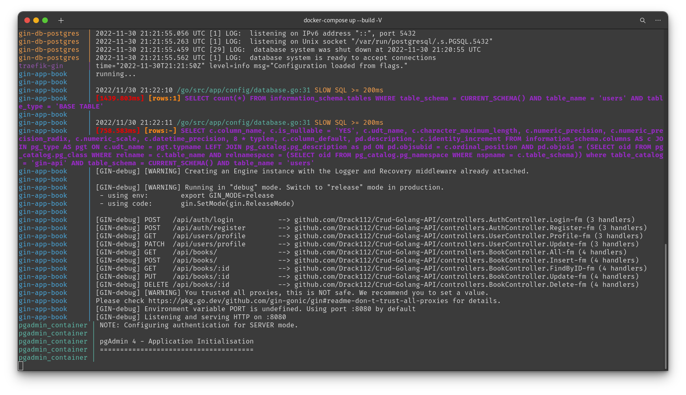

<p align="center">
  <a href="#" target="blank"></a>
</p>

<p align="center">
  <a href="#-tecnologias">Tecnologias</a>&nbsp;&nbsp;&nbsp;|&nbsp;&nbsp;&nbsp;
  <a href="#-projeto">Projeto</a>&nbsp;&nbsp;&nbsp;|&nbsp;&nbsp;&nbsp;
  <a href="#-como-executar">Como executar</a>&nbsp;&nbsp;&nbsp;|&nbsp;&nbsp;&nbsp;
  <a href="#-licença">Licença</a>
</p>

<p align="center">

  

</p>

<br>

<a id="-tecnologias"></a>

## ✨ Tecnologias

Esse projeto foi desenvolvido com as seguintes tecnologias:


<a id="-projeto"></a>

<p align="center">

  

</p>

## 💻 Projeto

Esse projeto de API é apenas um pequeno teste com o Gin Gionim, Gorm, token JWT no golang e Traefik

<a id="-como-executar"></a>

## 🚀 Como executar

### 💻 Pré-requisitos

Antes de começar, verifique se você atendeu aos seguintes requisitos:

- Você instalou a versão mais recente de `< Docker & Python>`

- Você tem uma máquina `< Windows / Linux / Mac >`.

- Você possui um `< Editor de código ou IDE / Gerenciador de banco de dados >`.

## ☕ Pequena ajuda

Preencha o arquivo `.env.example` com as informações cobradas e depois renomeie para `.env`.

```env
# Postgres Live
DB_HOST=db
# DB_HOST=127.0.0.1                             # when running the app without docker
SECRET_KEY=                           # Used for creating a JWT. Can be anything
DB_USER=
DB_PASSWORD=
DB_NAME=
DB_PORT=

# Used by pgadmin service
PGADMIN_DEFAULT_EMAIL=
PGADMIN_DEFAULT_PASSWORD=

# # Mysql Live
# DB_HOST=
# # DB_HOST=127.0.0.1                           # when running the app without docker
# DB_DRIVER=mysql
# SECRET_KEY=                       # Used for creating a JWT. Can be anything
# DB_USER=
# DB_PASSWORD=
# DB_NAME=
# DB_PORT=
```

### Se lembre de ter o Docker rodando :ocean:

E então, rode o comando `docker-compose up --build -V`.

Agora você pode acessar [localhost/api](localhost/api) do seu navegador.

<a id="licença"></a>

## 📄 Licença

Esse projeto está sob a licença MIT. Veja o arquivo [LICENSE](../LICENSE.md) para mais detalhes.

---

#### _Sinta-se livre para colaborar, toda ajuda é bem vinda ;)_
